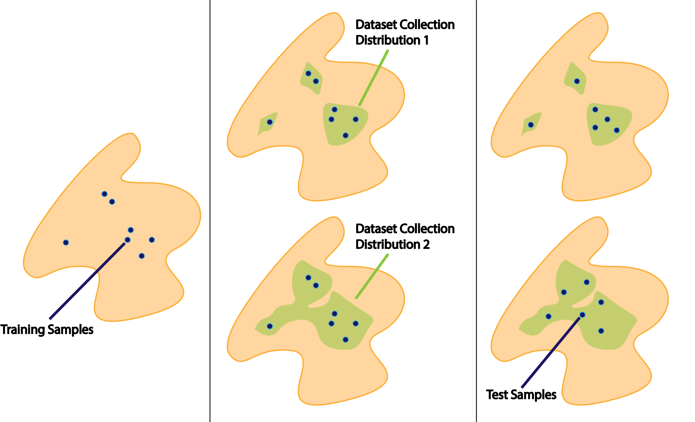
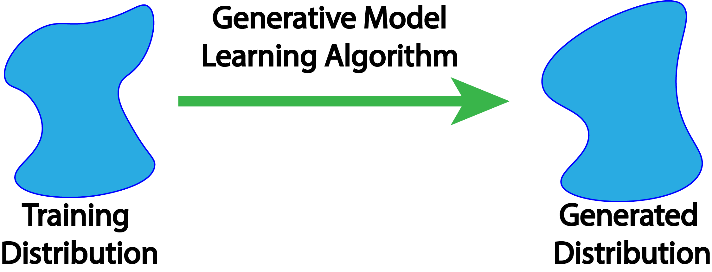
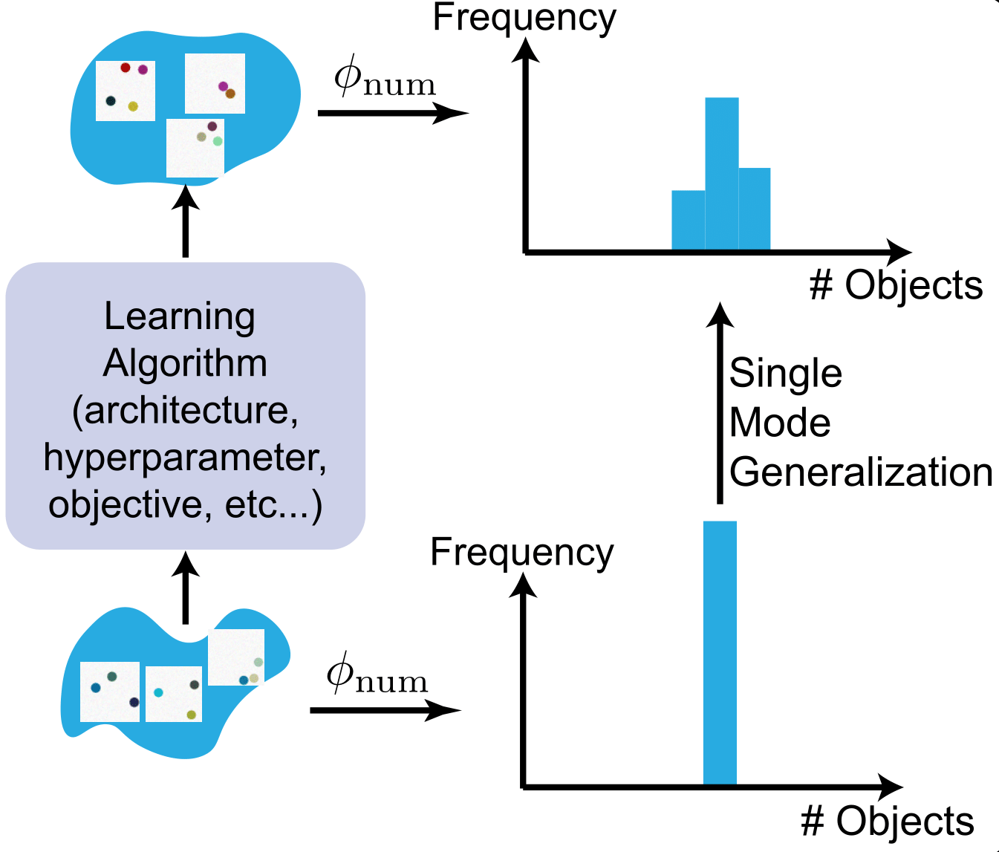
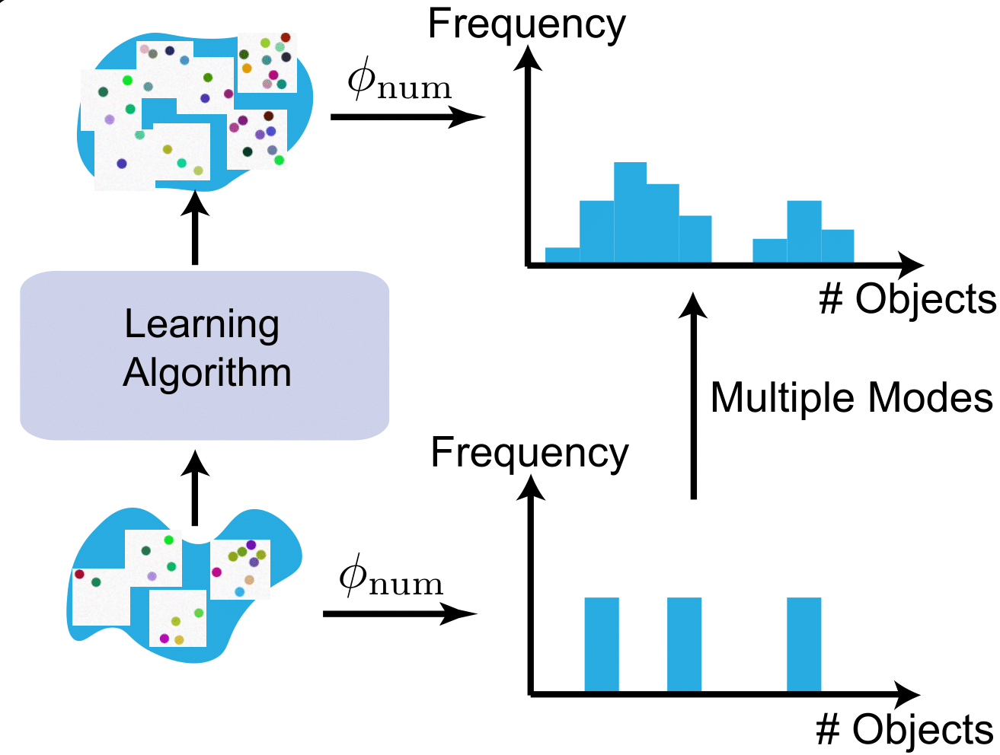

# The Problem of Generalization

Bias is crucial for deep generative models. The set of all possible natural images is extremely large (easily in the order of $2^{\mathrm{millions}}$), while the training set is absurdly small compared to it. By observing the tiny training set, which novel images should the learning algorithm generate? 

For example, if every image contains 2 objects, will generative models generate images with 1 or 3 objects?

If the training image has red/blue cars but only red buses, will generative models generate blue buses. 

These questions are difficult to answer. For example, should a model generate exotic combinations such as black swan or black snow. If they shouldn't, how do we decide which combinations are exotic and which are not? These questions seem to fundamentally lack a clear-cut correct answer. 

One could, of course, argue that log likelihood (on the test set) is a good evaluation metric -- at least it seems to be the least ad-hoc. However, in addition to the noted practical short-comings of log likelihood [1], there is a deep conceptual objection. 

## (One more) reason to be dissatisfied with log likelihood

Log likelihood measures whether the model produces a particular distribution --- our data collection distribution. However, it is seldomly questioned why this is a desirable goal to begin with.

For example, if we only look at the training samples (left figure), many different data collection distributions are plausible (middle figure), and if we draw additional test samples, they will also be different (right figure). 

However, we choose a particular `"ground truth" distribution when we decide the data collection process. For example, one image dataset may contain black swans because it is drawn from the internet (google"black swan" and there are plenty); another might not because it only include unmodified camera-taken images. Decisions in data collection drastically change the "ground truth" distribution. Then, why should we reward the learning algorithm for accurately producing a particular data collection distribution, but not anything else?

This issue is less severe for supervised learning. The key difference is that the goal of supervised learning --- prediction accuracy --- usually has intrinsic value. We can use it to make decisions about the future, but only in situations similar to the situations we collected the data from. It is still a worthy goal despite the short-coming (which domain adaptation or robustness seek to address). On the other hand, generative modeling is usually framed as a mean to an end. High likelihood by itself is not the most useful --- it is the downstream tasks: feature learning, perceptual compression, image synthesis and imputation, or even artistic design that are of greatest value.

# Empirical Study of Generalization

It seems that we must resort to human evaluation as the gold standard. This is indeed a must-have evaluation method for almost every generative models paper. However, human evaluation is biased by the taste of the human viewer. Is there something slightly more objective? 

In our paper [(ArXiv)](https://arxiv.org/abs/1811.03259) [(NeurIPS 2018 Spotlight Video)](https://www.videoken.com/embed/d37VHhPILAU?tocitem=40) we proposed a new method to visualize the behavior of a deep generative model. We think about the generative model training algorithm as a function that maps input training distribution into output generated distribution. We design input training distributions and observe the output generated distribution to "probe" this function.

However, images are high dimensional, so studying this function from training images to test images is infeasible. However, we can study this function when the inputs and outputs are projected into a low dimensional feature space. For example, we can look at the object-count feature, and look at the number of objects in input images, and the number of objects in output generated images. We propose three example strategies to probe the function.

Before we present the results, we remark that most results we present here (and in the paper) are qualitatively similar for different models (GAN, VAE, Recurrent), architectures (CONV, FC), parameter counts, training set sizes, and hyper-parameters. It is impossible to include everything, but we believe that our selection is sufficient inclusive, such that these results are most likely valid for typical modern instantiations of generative models. 

## Setup 1. Input-Output Relationship of a Single Value of a Single Feature

In our first setup, all images in the training set, when projected onto a feature space, takes a single value. As an example, we use numerosity (number of objects). For example, if all images in the training set contain 3 objects, will the generated images have a different numerosity? It seems that since the model is trained a hundreds of thousands of images --- each with 3 objects --- the model should generate images with 3 objects. Actually this is not true. 

Below we interactively visualize the training images (image with 1-9 dots) and the generated images. Observe that the number of generated dots is often different from the training images. 

[Insert interactive plots]

When we plot the number of dots in the paper, we observe that the generated numerosity is roughly a log-normal shaped distribution around the training numerosity. 
<!--   -->
<!-- 
 -->

We observed similar patterns for several other features (size, location, color).

## Setup 2. Input-Output Relationship of Multiple Values of a Single Feature

In our second setup, the training image, when projected onto a feature space, takes multiple values. It turns out that the output distribution is very predictable: we take its output distribution for each input value separately (i.e. we studied this in setup 1), and sum them up. In other words, the learning algorithm behaves like a linear filter. 

Below we interactive visualize the training distribution (e.g. the input image has either 10% or 50% red pixels: it is a distribution with two "spikes"), and the output distribution. Observe how the algorithm behaves like a linear filter. 

The exception is when the two distributions are close together (e.g. the input image is either 40% or 50% red). The generated distribution will he more concentrated around the mean (e.g. 45% red). This effect is referred to "prototype enhancement" [3] in cognitive psychology.  

[Insert interactive plots]

## Setup 3. Combinations of Multiple Features 

Finally we study the model's behavior when there are multiple features. We ask: if we observe some but not all combinations of two features, will the model generates new features. This helps us answer questions such as "will the model generate black swans?".  

Below we visualize the input combinations (MNIST digits) compared to the output combinations. It can be observed that when there are few combinations (e.g. 10), the model does not generate much new combinations. It always perfectly memorizes. When there are more (e.g. 80), the model generates almost every combination. 

[Insert interactive plots]

We emphasize that this is almost independent of model parameter-count and training set size. In fact, deep networks should be able to memorize huge amounts of random information [2], and when we train the model to memorize by supervised training, it indeed memorizes. This means that this phenomenon relate to how generative models are learned. 

We believe that this property --- whether generative models produce novel combinations --- is particularly important. Therefore, we provide a [toolbox](https://github.com/ermongroup/BiasAndGeneralization/tree/master/Evaluate) to visualize this property, and to calculate a performance metric indicating whether the model is prone to memorization or prone to generalization. 

# References
[1] Theis, Lucas, Aäron van den Oord, and Matthias Bethge. "A note on the evaluation of generative models." *arXiv preprint arXiv:1511.01844* (2015).

[2] Zhang et al 2016 

[3] prototype enhancement