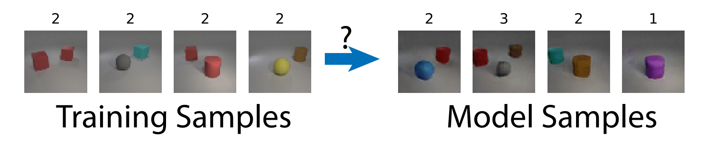

# The problem of Generalization

How do generative models generalize? For example, if every image contains 2 objects, will generative models generate images with 1 or 3 objects?

If the training image has red/blue cars but only red buses, will generative models generate blue buses. 

These questions are extremely difficult to answer. In fact, it is not even clear what is the better behavior. Should they generate combinations not in the training set. For example, should or shouldn't a model generate exotic combinations such as black swan or black snow?

One could, of course, argue that log likelihood (on test set) is a good metric of log likelihood. Of course, log likelihood is, perhaps, the most objective metric available. However, it has several short-comings, such as difficulty of evaluation, poor compatibility with GANs, and only reflects one aspect of model performance. 