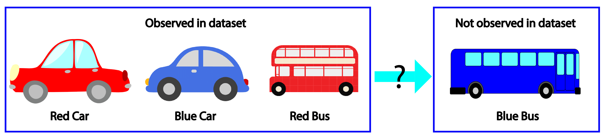

# The Problem of Generalization

How do generative models generalize? For example, if every image contains 2 objects, will generative models generate images with 1 or 3 objects?

If the training image has red/blue cars but only red buses, will generative models generate blue buses. 

These questions are extremely difficult to answer. In fact, it is not even clear what is "good" generalization. For example, should a model generate exotic combinations such as black swan or black snow. If they shouldn't, how do we decide which combinations are exotic and which are not? These questions seem to fundamentally lack a clear-cut correct answer. 

One could, of course, argue that log likelihood (on the test set) is a good evaluation metric -- or at least it seems to be the most objective and least ad-hoc. However, in addition to the noted practical short-comings of log likelihood [1], there is a deeper and more fundamental objection. 

## (One more) reason to be dissatisfied with log likelihood

When we talk about log likelihood we always assume some underlying distribution $p^*$, and test examples $x^1, \cdots, x^k$ drawn i.i.d. from $p^*$. However,$p^*$ is usually some **ad-hoc** distribution. For example, MNIST is collected from handwritten zipcodes from a particular population and preprocessed in a particular way --- had someone else prepared this dataset, it would certainly look much different --- $p^*$ is just an arbitrary subset of valid handwritten digits. The same can be said for essentially every dataset. <!-- When we say the training and test data $x^1, \cdots, x^k$ is drawn from $p^*$, we are actually referring to this ad-hoc distribution (conjured by the dataset collector).  -->
Good test log likelihood means that the model's generalization -- or its inductive bias -- conincide with the dataset collection process. 

 In supervised learning this is not a big issue: if any classifier wants to classify correctly on all images, it should at least classify correctly on our dataset -- achieving simultaneous high accuracy on different datasets is not inherently conflictory. However, if a generative model generates a distribution that is identical to one data collection process $p^*$, it cannot be identical to another. Agreeing with two different $p^*$ is inherently conflictory. 
 
 But if we just look at the data samples, which data collection distribution do they come from? There are many plausible answers. This is illustrated in the figure below. There is nothing special about the data collection process that we just happen to choose. Therefore, it is unclear why we should require our generative model to produce that particular distribution. 

<!-- In fact, this illustration far under-emphasize the magnitude of this issue. In practice, the set of possible images is huge, and not very well defined. Our data collection process, even one as comprehensive as imagenet only cover a small fraction of all possible scenes that could appear.   -->

# Empirical Study of Generalization

It seems that we must resort to human evaluation as the gold standard. This is indeed a must-have evaluation method for almost every generative models paper. However, human evaluation is biased by the taste of the human viewer, and the amount of hardwork put into cherry picking. Is there something slightly more objective? 

Note that human evaluation also gives us much more than a cold performance number, we can also observe the type of successes and failures the model demonstrates. The rick information is also one reason why human evaluation is often preferred. We would like to have that too. 

In our paper [(ArXiv)](https://arxiv.org/abs/1811.03259) [(NeurIPS 2018 Spotlight Video)](https://www.videoken.com/embed/d37VHhPILAU?tocitem=40) we proposed a new method to visualize the behavior of a deep generative model. Our proposed strategy is to design datasets to "probe" the behavior of the generative model. We think about the generative model training algorithm as a function that maps input training distribution into output generated distribution. 

However, as images are high dimensional, we choose low dimensional feature spaces to explore the model's behavior. We study the input - ouput relationship when it is projected into this low dimensional feature space. 

1. If every image in the training set has some feature, will different features be present in the generated images. 

2. If every image in the training set 

3. If the training image contain combinations of features, will the generative model generate new combinations?

To test this, we design a dataset where each image contains 

<h1>MNIST Result</h1>

Drag the slider to display the result.

 &nbsp;&nbsp;&nbsp;&nbsp;&nbsp;&nbsp;&nbsp;&nbsp;&nbsp;&nbsp;&nbsp;&nbsp;&nbsp;&nbsp;&nbsp;&nbsp;&nbsp;&nbsp;&nbsp;&nbsp;&nbsp;Training Distribution&nbsp;&nbsp;&nbsp;&nbsp;&nbsp;&nbsp;&nbsp;&nbsp;&nbsp;&nbsp;&nbsp;&nbsp;&nbsp;&nbsp;&nbsp;&nbsp;&nbsp;&nbsp;&nbsp;&nbsp;&nbsp;&nbsp;&nbsp;&nbsp;&nbsp;&nbsp;&nbsp;&nbsp;&nbsp;&nbsp;&nbsp;&nbsp;&nbsp;Generated Distribution (CNN)&nbsp;&nbsp;&nbsp;&nbsp;&nbsp;&nbsp;&nbsp;&nbsp;&nbsp;&nbsp;&nbsp;&nbsp;&nbsp;&nbsp;&nbsp;&nbsp;&nbsp;&nbsp;&nbsp;&nbsp;&nbsp;&nbsp;&nbsp;&nbsp;&nbsp;&nbsp;&nbsp;&nbsp;&nbsp;Generated Distribution (RNN) 

  <input type="range" min="1" max="10" value="30" class="slider" id="myRange">
  
Value: 

[1] Notes on evaluation of generative models